# kubernetes-tutorial
In this tutorial we will install 2 VM Images. One will server as the Kubernetes master, and the other a Kubernetes Node. We'll configure Docker and Kubernetes on both Images. We'll then optionally configure a Windows node and connect it to the cluseter.

## Install the Master and Node 

Note: when configuing the image with VirtualBox or VMWare Fusion, it is recommended to set up a second network, and assign stattic IP addressed - e.g. 172.31.x.x. However, in this example, we're are going to just use a single NAT network, which simplifies the configuration and works well.

### Download and setup CentOS 7
 - Download the DVD ISO from [CentOS Download Center](https://www.centos.org/download/)

 - Create a `kmaster` and `knode1`

 - The following screenshots will show an example of configuring the Master node using VMWare Fusion. After creating the Master Node, you can follow the same pattern to create the Worker Node. 

     
     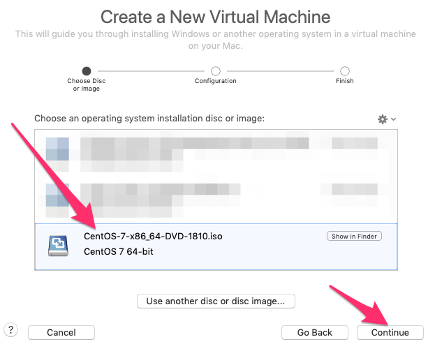
     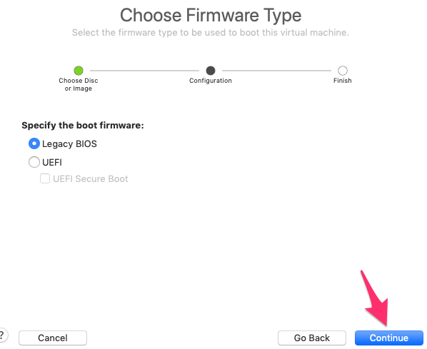
     
     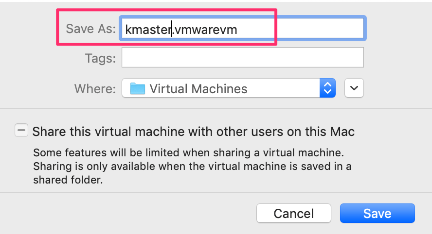
     
     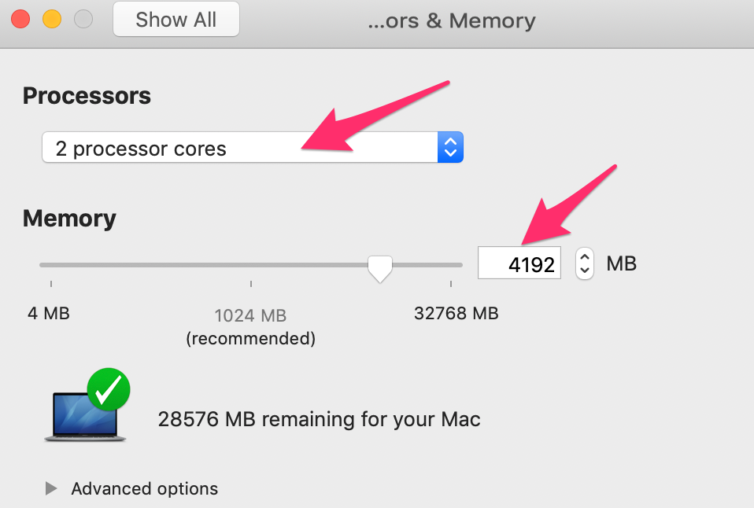
     
     
     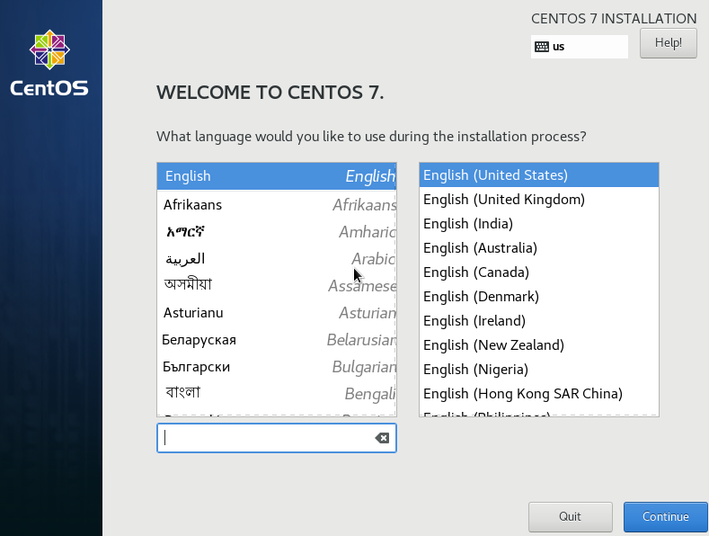
     
     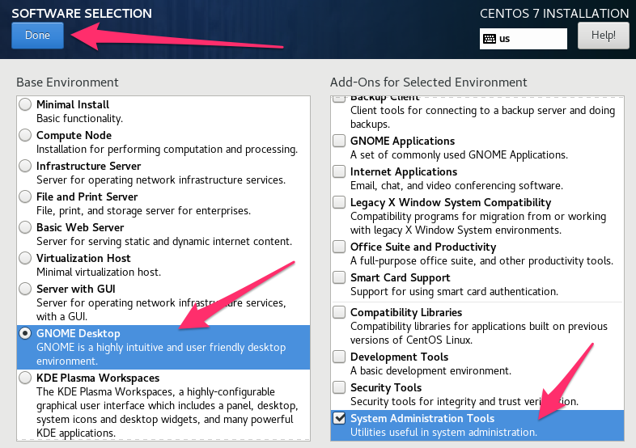
     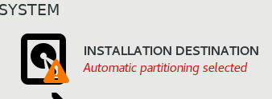
     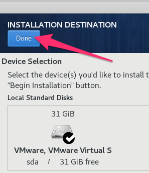
     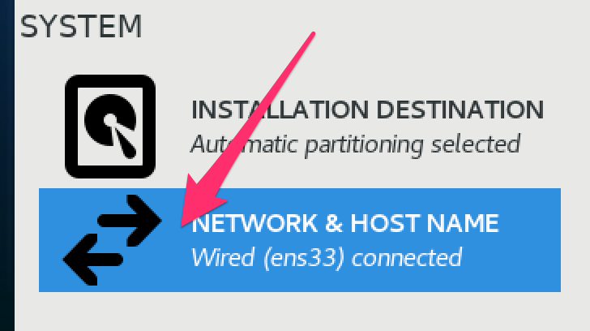
     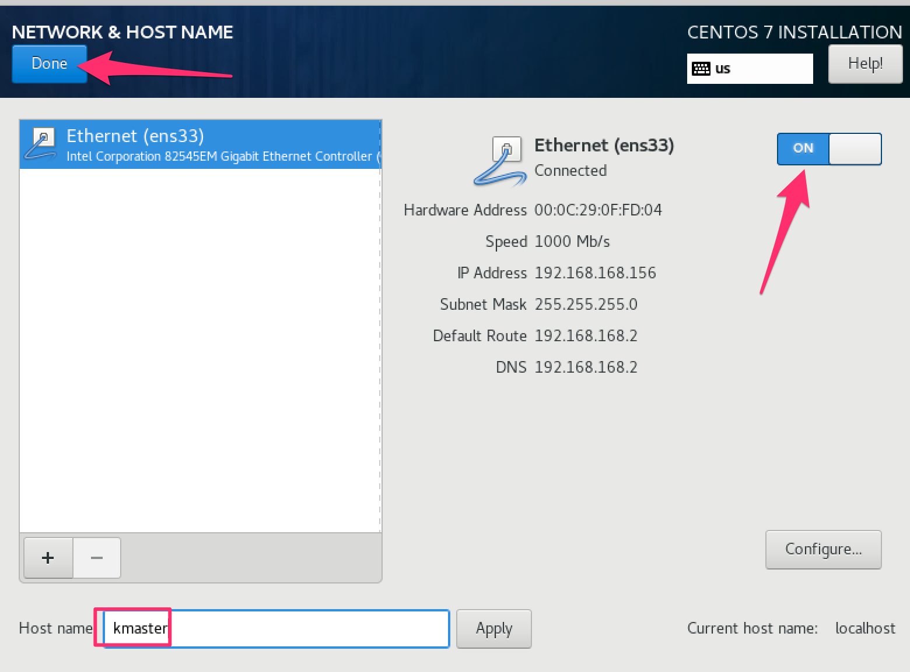
     
     
     
     
     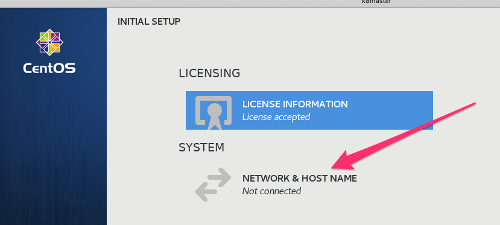
     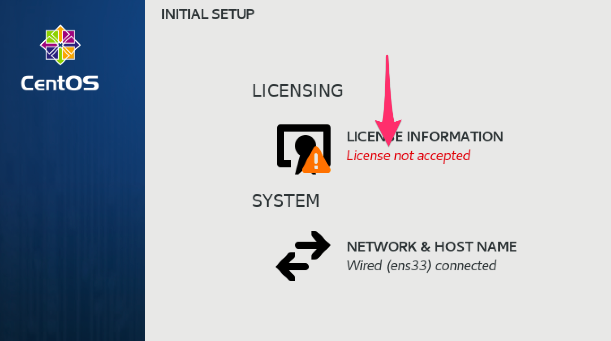
     

 - Start terminal windows

 - `$ sudo su`

 - If the hostnames have not been set correctly, you can us the following commands to set the Master and node to:`kmaster` and `knode1` 
 
    ```
    # hostnamectl set-hostname kmaster
    ``` 

- Turn off Swap

    Run commands as `sudo su` at the **#** prompt
    ```
    setenforce 0

    sed -i --follow-symlinks 's/SELINUX=enforcing/SELINUX=disabled/g' /etc/sysconfig/selinux

    swapoff -a
    ```

- Comment out the swap in fstab 

    Run commands as `sudo su` at the **#** prompt

    ```
    vi /etc/fstab
    ```

    

- Make sure your network connect is on - use **Network Setting console**

    

- Turn off the firewall

    Run commands as `sudo su` at the **#** prompt
    ```
    systemctl stop firewalld
    systemctl disable firewalld
    ```

- Allow Bridge/internet access over nat

    Run commands as `sudo su` at the **#** prompt
    ```
    modprobe br_netfilter
 
    echo '1' > /proc/sys/net/bridge/bridge-nf-call-iptables

    cat /proc/sys/net/bridge/bridge-nf-call-iptables
    ```

- Make permanent but editing sysctl.conf and causing br_netfilter to load

    Run commands as `sudo su` at the **#** prompt
    ```
    echo 'br_netfilter' > /etc/modules-load.d/br_netfilter.conf
 
    cat <<EOF >> /etc/sysctl.conf
    net.bridge.bridge-nf-call-ip6tables = 1
    net.bridge.bridge-nf-call-iptables = 1
    EOF
    ```

-   It's recommended to reboot the kmaster to knode1 images. Make sure all setting have taken effect after rebooting

- Once restarted, connect back into the image(s) and edit the host files in both images

    Run commands as `sudo su` at the **#** prompt
    ```
    vi /etc/hosts
    ```

    
 
- Setup yum to install kubernetes:

    Run commands as `sudo su` at the **#** prompt
    ```
    cat <<EOF > /etc/yum.repos.d/kubernetes.repo
    [kubernetes]
    name=Kubernetes
    baseurl=https://packages.cloud.google.com/yum/repos/kubernetes-el7-x86_64
    enabled=1
    gpgcheck=1
    repo_gpgcheck=1
    gpgkey=https://packages.cloud.google.com/yum/doc/yum-key.gpg
        https://packages.cloud.google.com/yum/doc/rpm-package-key.gpg
    EOF

    ```

- Run yum to install kubernetes and docker:

    Run commands as `sudo su` at the **#** prompt
    ```
    yum install -y kubelet kubeadm kubectl docker -y
    ```

- Update the kubernetes config file:

    Run commands as `sudo su` at the **#** prompt
    ```
    sed -i 's/cgroup-driver=systemd/cgroup-driver=cgroupfs/g' /etc/systemd/system/kubelet.service.d/10-kubeadm.conf
    ```

- Enable docker and kubernetes

    Run commands as `sudo su` at the **#** prompt
    ```
    systemctl enable docker && systemctl enable kubelet
    systemctl start docker && systemctl start kubelet
    ```

- ***Reboot*** the image(s)

### **Master only** install

- Setup Kubernetes

    Run the commands as `sudo su` at the **#** prompt
    ```
    kubeadm init --pod-network-cidr=10.244.0.0/16 --apiserver-advertise-address=REPLACE-WITH-YOUR-IP-ADDRESS
    ```

- **Copy the Join** message and store locall for later use.

    

- Exit to **$** / kubeuser / non sudo user

    If connected as `sudo`, exit to the **$** prompt
    ```
    exit

    $  # you shoud be here....
    ```

    Run commands as `kubeuser` at the **$** prompt
    ```
    mkdir -p $HOME/.kube
    sudo cp -i /etc/kubernetes/admin.conf $HOME/.kube/config
    sudo chown $(id -u):$(id -g) $HOME/.kube/config
    ```

- Wait for all Pods to show running, with the exception of the **coredns** pods which will change to running later when the flannel network is configured. 

    Run commands as `kubeuser` at the **$** prompt
    ```
    kubectl get pods -o wide --all-namespaces
    ```

    

- Continue with the [KubeNetConfig.md](./KubeNetConfig.md) entryto complete the Kubernetes install.


