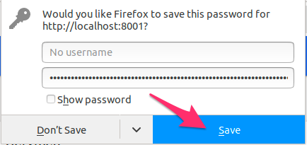
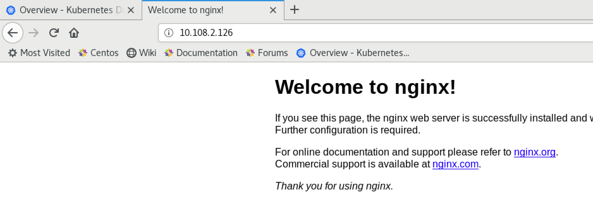

# Configure Kubernetes

If you plan on including Windows nodes, you need to set up the Flannel Network and Proxy configuration using **Host Gateway Mode**, as apposed to **VXLAN**. Choose the correct version of **Step 1** based on the desire to include Windows nodes.

## Flannel Network Configuration

### **Step 1 -** ***No Windows Nodes***: Install the Flannel Network

The following is to be performed on the **kmaster** image

- Notice that not all pods are working. We will resolve this by installing the pod network. In our example we are going to use a **Flannel** network. 

- ***Run commands*** as `kubeuser` at the **$** prompt - **NOT** at the sudo **#** prompt

    ```
    $ kubectl apply -f https://raw.githubusercontent.com/coreos/flannel/master/Documentation/kube-flannel.yml
    ```

    

- Go to **Step 2**

### **Step 1 -** ***Potential Windows Nodes***: Install the Flannel Network

- It is recommended to enable bridged IPv4 traffic to iptables chains when using Flannel. This can be done using the following command:

    ```
    sysctl net.bridge.bridge-nf-call-iptables
    ```

    if not set to 1

    ```
    sudo sysctl net.bridge.bridge-nf-call-iptables=1
    ```

- Download the recent Flannel Config file

    ```
    wget https://raw.githubusercontent.com/coreos/flannel/master/Documentation/kube-flannel.yml
    ```

- There are two sections you should modify to enable the vxlan networking backend:
  
    After applying the steps below, the net-conf.json section of kube-flannel.yml should look as follows:

    ```json
    net-conf.json: |
        {
          "Network": "10.244.0.0/16",
          "Backend": {
            "Type": "vxlan",
            "VNI" : 4096,
            "Port": 4789
          }
        }
    ```
    
- ***Note*** The VNI must be set to 4096 and port 4789 for Flannel on Linux to interoperate with Flannel on Windows. Support for other VNIs is coming soon. See the VXLAN documentation at https://github.com/coreos/flannel/blob/master/Documentation/backends.md#vxlan for an explanation of these fields.

- You **cni-conf.json** should look as follows:

    ```json
    cni-conf.json: |
        {
          "name": "vxlan0",
          "plugins": [
            {
              "type": "flannel",
              "delegate": {
                "hairpinMode": true,
                "isDefaultGateway": true
              }
            },
            {
              "type": "portmap",
              "capabilities": {
                "portMappings": true
              }
            }
          ]
        }
    ```

- Apply the flannel network

    ```
    kubectl apply -f kube-flannel.yml
    ```

- View the pods and wait for the **coredns** pods to show running

    ```
    kubectl get pods -o wide --all-namespaces
    ```

    


- Apply the patch to the Flannel Network - ***Note**: Ensure that you select the correct flannel pod for your system. In this example, I'm using **amd64**, but you might use arm, arm64, ppc64le, s390x, etc.

    ```
    kubectl patch ds/kube-flannel-ds-amd64 --patch "$(cat node-selector-patch.yml)" -n=kube-system
    ```

- check on the patch

    ```
    kubectl get ds -n kube-system
    ```

    

- Patch the linux kube-proxy DaemonSet to target Linux only. ***Note: Don't run this. Testing***

    Run commands as `kubeuser` at the **$** prompt
    ```
    kubectl get ds/kube-proxy -o go-template='{{.spec.updateStrategy.type}}{{"\n"}}' --namespace=kube-system
    ```

- Create this file

    ```
    vi node-selector-patch.yml
    ```
- Past the fillowing into the file, and save

    ```yaml
    spec:
      template:
        spec:
          nodeSelector:
            beta.kubernetes.io/os: linux
    ```

- Patch the damon setls


    ```
    kubectl patch ds/kube-proxy --patch "$(cat node-selector-patch.yml)" -n=kube-system
    
    kubectl patch ds/kube-flannel-ds-amd64 --patch "$(cat node-selector-patch.yml)" -n=kube-system
    ```

- check on the patch

    ```
    kubectl get ds -n kube-system
    ```

    

- Follow the instruction from here titled **Collecting Cluster Info** to identify some of the information needed later.

    [Microsoft Doc - K8s 1.13](https://docs.microsoft.com/en-us/virtualization/windowscontainers/kubernetes/creating-a-linux-master)
    [Microsoft Doc - K8s 1.14](https://kubernetes.io/docs/setup/windows/user-guide-windows-nodes/)


## Dashboard Install
    
### **Step 2**: Install the Dashboard

- We are going to install the Dashboard prior to joining a node. Installing with only the Master node available will cause the Dashboard to be installed on the Master Node, which is a good practice. Run the following command to install the Dashboard

    ```
    kubectl create -f https://raw.githubusercontent.com/kubernetes/dashboard/master/aio/deploy/recommended/kubernetes-dashboard.yaml

    ```
    

- Wait for the kube dashboard to show a **Running** state

    ```
    kubectl get pods -o wide --all-namespaces
    ```

    

- Open another terminal and create a Service Account

    ```
    kubectl create serviceaccount dashboard -n default
    ```

    ```
    kubectl create clusterrolebinding dashboard-admin -n default \
    --clusterrole=cluster-admin \
    --serviceaccount=default:dashboard
    ```

- Get the Secrect and save it for later use. Note, you can always recoved this credential by re-running the command below.

    ```
    kubectl get secret $(kubectl get serviceaccount dashboard -o jsonpath="{.secrets[0].name}") -o jsonpath="{.data.token}" | base64 --decode
    ```

    

- Run the proxy command so we can access the Kubernetes Dashboard

    ```
    kubectl proxy
    ```

- Load the the Firefox browser and go to the following URL:

    ```
    http://localhost:8001/api/v1/namespaces/kube-system/services/https:kubernetes-dashboard:/proxy/
    ```

- Select the **Token** option, and enter the Secret you just created

    

- Click on the **Save** button to save the token

    

## Join Node and Test Application

### **Step 3**: Join knode1 **(Linux)** node to the kmaster

***Note:*** The following step's command must be run only on the "Node"

- **VERIFY** that you are on the **KNODE1** Image

- On the **knode1** image open a **terminal** window and run the following command:
    
    ```
    sudo su
    ```

 - Use the **kubeadm join** command you saved earlier to join **knode** to **kmaster**

    
    
### **Step 4**: Install and test an application

***Note:*** The commands in this step are run on the "Master"

- ***Return to a terminal window*** on the **kmaster** image and run the following command. Wait until **knode1** shows a **Ready** state

    Run commands as `kubeuser` at the **$** prompt
    ```
    kubectl get nodes
    ```

    

- Run the following command to deploy the **nginx** service and deployment

    ```yaml
    cat <<EOF | kubectl apply -f -
    apiVersion: v1
    kind: Service
    metadata:
      name: nginx-server
      namespace: default
      labels:
        app: nginx-server
    spec:
      ports:
      - port: 80
        name: http
      selector:
        app: nginx-server
    ---
    apiVersion: extensions/v1beta1
    kind: Deployment
    metadata:
      name: nginx-http
      namespace: default
    spec:
      replicas: 1
      template:
        metadata:
          labels:
            app: nginx
        spec:
          containers:
          - name: nginx-server
            image: nginx
            imagePullPolicy: IfNotPresent
            ports:
            - containerPort: 80
    EOF
    
    ```

- Execute the following command to see the nginx-server

    ```
    kubectl get pods -o wide --all-namespaces
    ```

- Wait for the nginx to show running

    

- Expose the port

    ```
    kubectl expose deployment nginx-http --port=80 --name=nginx-http
    ```

- Get the service info

    ```
    kubectl get service
    ```

    

- Run curl command using ip from get service command

    ```
    curl -I <IP ADDRESS>
    ```

    

- Access from the browser

    

- If you are going to Create a **Windows Node**, go [WindowsNode.md Document](./WindowsNode.md)

**OR**

- Got to the [Istio.md Document](./README.md) to install and configure Istio
