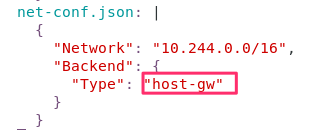

If you plan on including Windows nodes, you need to set up the Flannel Network and Proxy configuration differently. Choose the correct **Step 1** based on the desire to include Windows nodes.

### ***Step 1***: With ***No Windows Nodes*** - Install the Flannel Network

The following is to be performed on the **kmaster** image

- Notice that not all pods are working. We will resolve this by installing the pod network. In our example we are going to use a **Flannel** network. 

    ```
    $ kubectl apply -f https://raw.githubusercontent.com/coreos/flannel/master/Documentation/kube-flannel.yml
    ```

    

- Go to **Step 2**

### ***Step 1***: With ***Windows Nodes*** - Install the Flannel Network

- Patch the linux kube-proxy DaemonSet to target Linux only. 

    ```
    $ kubectl get ds/kube-proxy -o go-template='{{.spec.updateStrategy.type}}{{"\n"}}' --namespace=kube-system
    ```

- Create this file

    ```
    nano node-selector-patch.yml
    ```
- Past the fillowing into the file, and save

    ```
    spec:
      template:
        spec:
          nodeSelector:
            beta.kubernetes.io/os: linux
    ```

- Patch the damon setls


    ```
    kubectl patch ds/kube-proxy --patch "$(cat node-selector-patch.yml)" -n=kube-system
    ```

- check on the patch

    ```
    kubectl get ds -n kube-system
    ```

    

- Follow the instruction from here titled **Collecting Cluster Info**

    [Microsoft Doc](https://docs.microsoft.com/en-us/virtualization/windowscontainers/kubernetes/creating-a-linux-master)

- It is recommended to enable bridged IPv4 traffic to iptables chains when using Flannel. This can be done using the following command:

    ```
    sysctl net.bridge.bridge-nf-call-iptables
    ```

    if not set to 1

    ```
    sudo sysctl net.bridge.bridge-nf-call-iptables=1
    ```

- Get the recent Flannel Config file

    ```
    wget https://raw.githubusercontent.com/coreos/flannel/master/Documentation/kube-flannel.yml
    ```

- Edit the file and change `vxlan` to `host-gw` and save the file

    

- Apply the flannel network

    ```
    kubectl apply -f kube-flannel.yml
    ```

- Apply the patch to the Flannel Network - ***Note**: Ensure that you select the correct flannel pod for your system. In this example, I'm using **amd64**, but you migth use arm, arm64, ppc64le, s390x, etc.

    ```
    kubectl patch ds/kube-flannel-ds-amd64 --patch "$(cat node-selector-patch.yml)" -n=kube-system
    ```

- check on the patch

    ```
    kubectl get ds -n kube-system
    ```
    
### **Step 2**: Join knode to the kmaster


- Now that the flannel network is installed, you should see that the **coredns...** pods are now in a **running** status. You'll need to re-run the command below multiple times until everything restarts.

    ```
    $ kubectl get pods -o wide --all-namespaces
    ```

    

    ```
    $ kubectl create -f https://raw.githubusercontent.com/kubernetes/dashboard/master/aio/deploy/recommended/kubernetes-dashboard.yaml

    ```
    

- Wait for the kube dashboard to show a **Running** state

    ```
    $ kubectl get pods -o wide --all-namespaces
    ```

    

- Run the proxy command so we can access the Kubernetes Dashboard

    ```
    $ kubectl proxy
    ```

    

- Open another terminal and create a Service Account

    ```
    $ kubectl create serviceaccount dashboard -n default
    ```

    

    ```
    $ kubectl create clusterrolebinding dashboard-admin -n default \
    --clusterrole=cluster-admin \
    --serviceaccount=default:dashboard
    ```

    

- Get the Secrect and save it for later use

    ```
    $ kubectl get secret $(kubectl get serviceaccount dashboard -o jsonpath="{.secrets[0].name}") -o jsonpath="{.data.token}" | base64 --decode
    ```

    

- Load the the Firefox browser and go to the following URL:

    ```
    http://localhost:8001/api/v1/namespaces/kube-system/services/https:kubernetes-dashboard:/proxy/
    ```

- Select the **Token** option, and enter the Secret you just created

    

- Click on the **Save** button to save the token

    

### **Step 3**: Join knode **(Linux)** to the kmaster

***Note:*** The following step's command must be run only on the "Node"

- On the **knode** image impen a **terminal** window and run the following command:
    
    ```
    $ sudo su
    ```

 - Use the **kubeadmin join** command you saved earlier to join **knode** to **kmaster**

    

### **Step 3**: Join knode **(Windows)** to kmaster

- Follow these instructions **Joining the Windows Node**

    ```
    https://docs.microsoft.com/en-us/virtualization/windowscontainers/kubernetes/joining-windows-workers
    ```

- Get Service Subnet/CIDR:

    ```
    kubectl cluster-info dump | grep -i service-cluster-ip-range
    ```

- Get Kube DNS

    ```
    kubectl get svc/kube-dns -n kube-system
    ```

- Using the correct Addresses discovered earlier, run this:

    ```
    cd c:\k
.\start.ps1 -ManagementIP <Windows Node IP> -ClusterCIDR <Cluster CIDR> -ServiceCIDR <Service CIDR> -KubeDnsServiceIP <Kube-dns Service IP>
    ```

    ```
    cd c:\k
.\start.ps1 -ManagementIP 172.31.0.35:6443 -ClusterCIDR 10.244.0.0/16 -ServiceCIDR 10.96.0.0/12 -KubeDnsServiceIP 10.96.0.10
    ```
    
### **Step 4**: Install a test application

***Note:*** The commands in this step are run on the "Master"

- Return to a terminal window on the **kmaster** image and run the following command. Wait until **knode** shows a **Ready** state

    ```
    $ kubectl get nodes
    ```

    

- Run the following command to install the **nginx** server pod

    ```
    $ kubectl run --image=nginx nginx-server --port=80 --env="DOMAIN=cluster"
    ```

- Execute the following command to see the nginx-server

    ```
    $ kubectl get pods -o wide --all-namespaces
    ```

- Wait for the nginx to show running

    

- Expose the port

    ```
    $ kubectl expose deployment nginx-server --port=80 --name=nginx-http
    ```

- Get the service info

    ```
    $ kubectl get service
    ```

    

- Run curl command using ip from get service command

    ```
    $ curl -I <IP ADDRESS>
    ```

    

- Access from the browser

    

- Return the [README.md](./README.md) to complete the Kubernetes install
