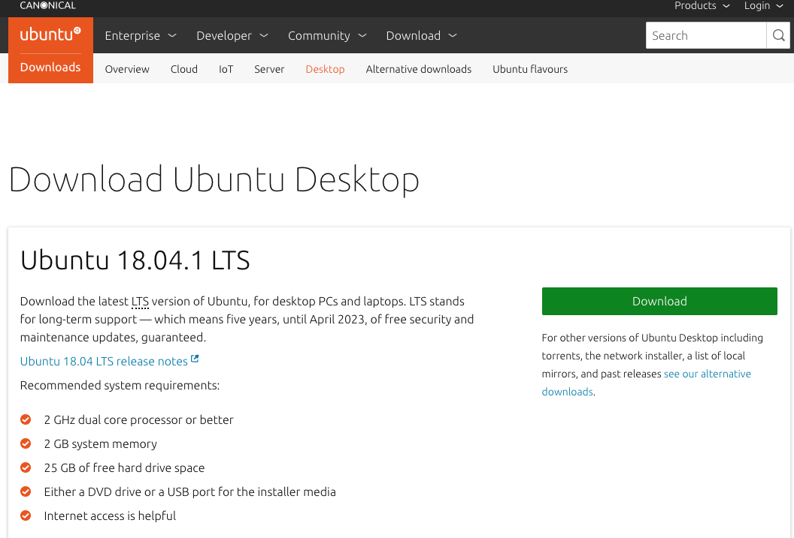
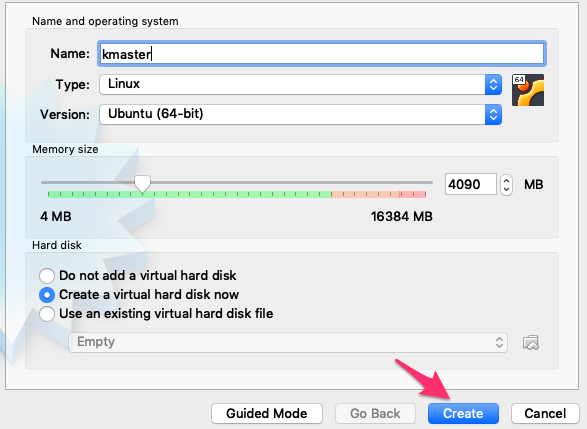

# kubernetes-tutorial
Test tutorial

## Install the Master and Minion 
### Download Ubuntu 18.0.4 Desktop ISO

- From this URL [Ubuntu Destop Downloads](https://www.ubuntu.com/download/desktop), get the iso image
- Select the latest (LTM) image. I'm using 18.04.1 LTS

    

- Select the Latest (LTS) 

### **Step 1**: Create a Virtual Box **kmaster** node/image

- Load VirtualBox and click on **New**

    

- Enter the following, and click on **Commit**:
    - Name: `kubernetes`
    - Type: `Linux`
    - Version: `Ubuntu (64-bit)`
    - Hard disk: **Create a virtual hard disk now**

    

- Enter the following Disk Information and click on **Commit**
    - File Location: `kmaster`
    - File Size: `30GB`
    - Hard disk file type: `VDI (VirtualBox Disk Image)

    

- With **kmaster** selected, click on **settings**

    

- Update the System Settings:
    - Select **System** and **Processor**
    - Set the number of CPUs to at least `2`

    

- Add a second network
    - Click on **Network** and **Adapter 2** in the tool bar
    - Click on **Enable Network Adapter**
    - For Attached to, select **Host-only Adapter**
    - Click on **OK**

    

- Attach the Ubuntu ISO
    - Click on the **Storage** menu option
    - Click on the **Empty** icon below the IDE Controller
    - Click on the **Optical Drive** CD Icon
    - Select **Choose Virtual Optical Disk Drive** from the drop down menu

    

- Navigate to and select the ubuntu iso you downloaded. Click on **OK**

    

- Click on **Start** to start the kmaster image

    

### **Step 2**: Install Ubuntu

- Once the image starts, click on **Install Ubuntu**

    

- Select your keyboard layout and click on Continue
- I selected the **Minimal installation**, but the normal installation will also work
- Click on Continue

    

- Keep the **Erase disk and install Ubuntu** defaults, and click on **Install Now**

    

- Click on **Continue** when asked about Writing changes to disk.
- Select your timezone
- Configure the username and hostname:
    - Your Name: `kubeuser`
    - Your Computer: `kmaster`
    - Pick a username: `kubeuser`
    - I selected **Log in automatically**

    

- When prompted, click on **Restart Now**

- When prompted with **Please remove the installation medium, then press ENTER:**, press the **Enter Key** in the image. Note: you can generally just press enter, as VBox will have automatically removed the ubuntu ISO during the installation process. If not, you can remove it using the **Settings**


### **Step 3**: Create a **knode** Ubuntu image

- Repeat **Steps 1 and 2** to create a kubernetes slave image, with the following **modifications**:
    - Changes any references of `kmaster` to `knode` 
    - Set the RAM to 3GB

- You should now have both the **kmaster** and **knode** images running:

    

    

- If is a good idea to install the VBox tools

    

    

- Reboot your images for VBox tools to work

- On both images, you may want to share the clipboard to allow for command copy and paste:

    


### **Step 4**: Perform package installations on **BOTH** images

- The following tasks are to be **run on both** the master and node images:

- Optional: If you want to turn off asking for a password when using the `sudo su` command, then follow these tasks:
    - From your terminal window enter:

    ```
    sudo visudo
    ```

    - At the bottom of the file, enter this line:

    ```
    kubeuser ALL=(ALL) NOPASSWD:ALL
    ```

    

    - Save the file by pressing **Ctrl+X**, then enter **Y** and hit **Enter** to save the file.

- Login as 'sudo' and run the following commands :

    ```
    sudo su
    apt-get update
    ```

    

- Kubernetes will throw errors if the swap space is not turned off. The following commands will turn swap off (Still as sudo user):

    ```
    swapoff -a
    nano /etc/fstab
    ```

- Comment out the line that references the **swapfile**. Then hit **Ctrl+X**, press **Y** and hit **Enter** to save the file.

    

- As sudo, check to ensure that the host file contains `kmaster` and `knode` on the respective images

    ```
    nano /etc/hostname
    ```

    

- As sudo, install net-tools

    ```
    apt-get install net-tools
    ```

    

- As sudo, on each image run ifconfig, and note the **network name and ip address** for the Host only network adapter for both kmaster and knode

    ```
    ifconfig
    ```

    In my example, here is **KMASTER**:

    

    Here is **KNODE**:

    

- As sudo, set the host file in both images to reference the **kmaster** and **knode** ip addresses

    ```
    nano /etc/hosts
    ```

    

- ADD NOTE ABOUT NOW TO ADD THE /etc/network/interfaces update

    ```
    sudo nano /etc/network/interfaces
    ```

- Change the file
    ```
    auto enp0s8
    iface enp0s8 inet static
    address 192.168.99.100
    ```

### Reboot Servers

- As sudo, install open ssh server

    ```
    sudo su
    apt-get install openssh-server
    ```

    

### **Step 5**: Install Docker on **BOTH** images

- As sudo, run the following commands to install docker

    ```
    sudo su
    apt-get update
    apt-get install -y docker.io
    ```

- Enable to docker service

    ```
    systemctl enable docker.service
    ```

### **Step 6**: Install Kubernetes on **BOTH** images

- As sudo, run the following command to install kubernetes

    ```
    apt-get update && apt-get install -y apt-transport-https curl

    curl -s https://packages.cloud.google.com/apt/doc/apt-key.gpg | apt-key add -

    cat <<EOF >/etc/apt/sources.list.d/kubernetes.list
    deb http://apt.kubernetes.io/ kubernetes-xenial main
    EOF

    apt-get update
    ```

- As sudo, install **Kubelet, kubeadmn, and kubectl**

    ```
    apt-get install -y kubelet kubeadm kubectl 
    ```

- Update the Kubernetes config file

    ```
    nano /etc/systemd/system/kubelet.service.d/10-kubeadm.conf
    ```

- Add the following **Environment** entry to the config file

    ```
    Environment="cgroup-driver=systemd/cgroup-driver=cgroupfs"
    ```

    

- At this point, I'd recommend shuting down each image, taking a snapshot, and restarting

### **Step 6**: Configure Kubernetes Master - Run **ONLY on kmaster** image

- Start the kubernetes cluster. **Note**: We will be using a Flannel network, so we are using 10.244.0.0/16 for the pod-network-cidr. **Replace \<ip-address-of-kmaster-vm\>** with your kmaster's host address. In our example that is 192.168.99.100

    ```
    kubeadm init --apiserver-advertise-address=<ip-address-of-kmaster-vm> --pod-network-cidr=10.244.0.0/16
    ```

    

- When the kubeadm init command completes, copy the **kubeadm join** command and save it, as this command will later be used to join **knode** to the cluster

    

- You will **NOT** run the next command from the sudo user **#** promot, so ensure that you exit the sudo user and the **$** prompt is visible

    

    ```
    mkdir -p $HOME/.kube
    sudo cp -i /etc/kubernetes/admin.conf $HOME/.kube/config
    sudo chown $(id -u):$(id -g) $HOME/.kube/config
    ```

    

- Ensure that kubectl is working

    ```
    kubectl get pods -o wide --all-namespaces
    ```

    

- Notice that not all pods are working. We will resolve this by installing the pod network. In our example we are going to use a **Flannel** network. 

    ```
    kubectl apply -f https://raw.githubusercontent.com/coreos/flannel/master/Documentation/kube-flannel.yml
    ```

    

- Now that the flannel network is install, you shoudl see that the **coredns...** pods are now in a **running** status

    ```
    kubectl get pods -o wide --all-namespaces
    ```

    

    ```
    kubectl create -f https://raw.githubusercontent.com/kubernetes/dashboard/master/src/deploy/recommended/kubernetes-dashboard.yaml
    ```
    

    ```
    kubectl proxy
    ```

    

- Open another terminal

    ```
    kubectl create serviceaccount dashboard -n default
    ```

    

    ```
    kubectl create clusterrolebinding dashboard-admin -n default \
    --clusterrole=cluster-admin \
    --serviceaccount=default:dashboard
    ```

    

    ```
    kubectl get secret $(kubectl get serviceaccount dashboard -o jsonpath="{.secrets[0].name}") -o jsonpath="{.data.token}" | base64 --decode
    ```

    

- enter URL on browser:

    ```
    http://localhost:8001/api/v1/namespaces/kube-system/services/https:kubernetes-dashboard:/proxy/
    ```

    

    

- Holder

### **Step xxx**: Join other image

- Holder
    
    ```
    sudo su
    < use the kubeadmin join command you coppied earlier for example: >
    kubeadm join 192.168.99.100:6443 --token 7f8vt2.axlyzylzkj6m66cq --discovery-token-ca-cert-hash sha256:6d6ef81f7053fafdef1c585c1ab27f7bc1de389b756cfead18587b81f6abaf25
    ```
    
### back on the master

- Holder

    ```
    kubectl get nodes
    ```

    

### Install a pod

- Holder

    ```
    kubectl run --image=nginx nginx-server --port=80 --env="DOMAIN=cluster"
    kubectl expose deployment nginx-server --port=80 --name=nginx-http
    ```

- run until ready

    ```
    kubectl get pods -o wide --all-namespaces
    ```

- Wait for the image to show running

    

- Get the service info

    ```
    kubectl get service
    ```

    

- Run curl command using ip from get service command

    ```
    curl -I <IP ADDRESS>
    ```
    
    


